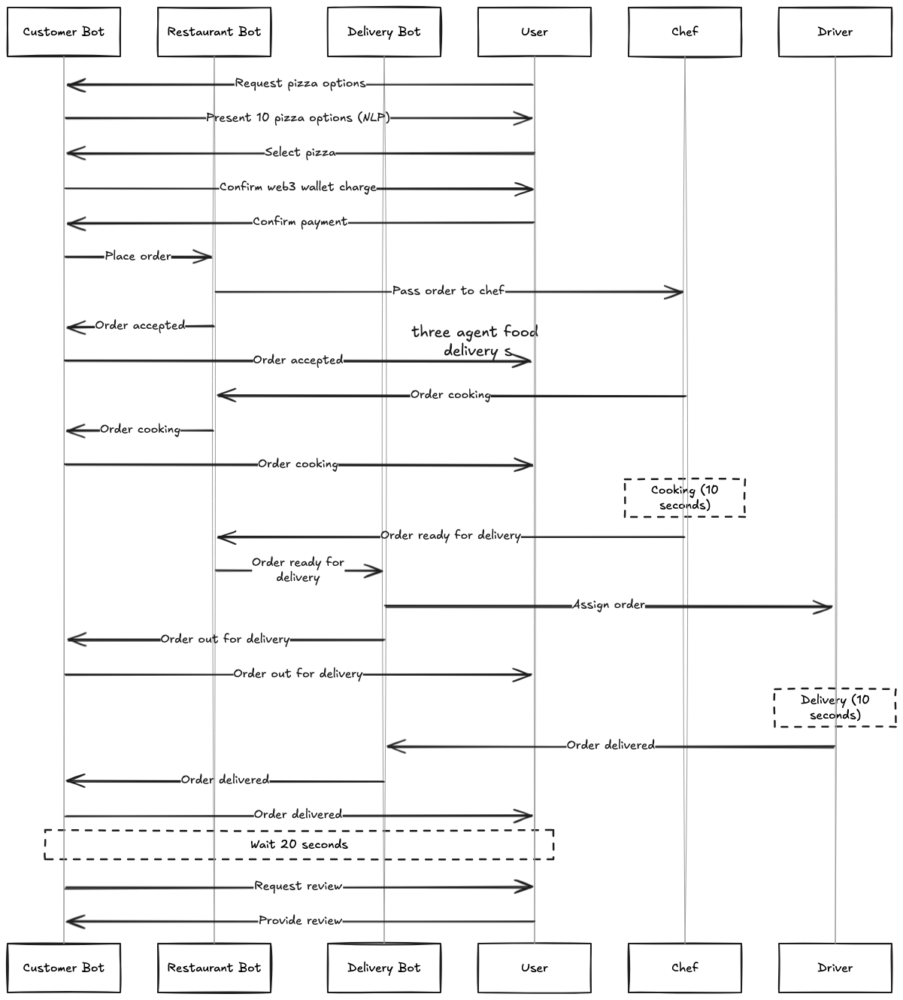
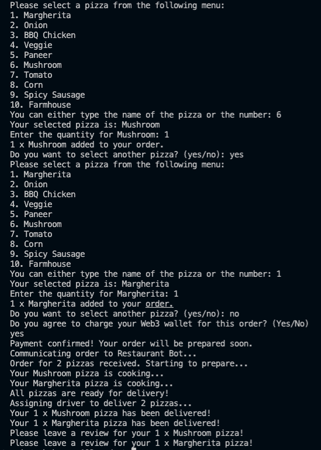

# Food Delivery System - Three-Agent

This project simulates a **food delivery system** using a **three-agent architecture**. The system consists of three distinct agents:
- **Customer Bot (Agent 1)**: Manages the interaction with the customer, handles pizza selection, payment confirmation, and asks for a review post-delivery.
- **Restaurant Bot (Agent 2)**: Accepts the order, handles pizza preparation (cooking), and updates the order status as it progresses.
- **Delivery Bot (Agent 3)**: Manages the delivery of the pizza, assigns drivers, and provides updates to the customer.

---

## Solution Structure

### **Customer Bot (Agent 1)**
- **Pizza Selection**: Allows customers to select pizzas either by name (using NLP) or number. Supports fuzzy string matching for name-based selection.
- **Payment Confirmation**: Prompts the customer to confirm their payment method (Web3 wallet/Metamask wallet integration or alternative payment methods like credit card or Paytm).
- **Review Request**: After the delivery, waits for 20 seconds and then asks the customer for a review of the entire order.

### **Restaurant Bot (Agent 2)**
- **Order Acceptance**: Accepts the order from the Customer Bot and starts the pizza cooking process.
- **Cooking Simulation**: Simulates a 10-second cooking time for all pizzas in the order.
- **Order Status Update**: Updates the order status from **Accepted** to **Cooking** to **Ready for Delivery** and passes the order to the Delivery Bot.

### **Delivery Bot (Agent 3)**
- **Driver Assignment**: Assigns a driver to deliver the pizzas once the Restaurant Bot marks the order as "Ready for Delivery."
- **Delivery Simulation**: Simulates the delivery process, taking 10 seconds, and updates the customer once the pizzas are delivered.
- **Review Prompt**: After delivery, notifies the Customer Bot to request a review.

---

## Workflow

1. **Customer Bot**: 
   - Presents a menu of pizzas and allows the customer to select by either pizza name or number.
   - Asks the customer for the quantity of each pizza ordered.
   - Confirms the payment method and sends the order to the Restaurant Bot.

2. **Restaurant Bot**: 
   - Receives the order, simulates a 10-second cooking time for all pizzas in the order.
   - Updates the order status and sends the ready order to the Delivery Bot.

3. **Delivery Bot**: 
   - Assigns a driver for the delivery, simulates the delivery process, and provides the customer with an update once the pizzas are delivered.
   
4. **Review Handling**: 
   - After the delivery is completed, the customer is prompted for a review of the entire order after a 20-second delay.

---

## Features and Benefits

- **Flexible Pizza Selection**: Customers can choose pizzas either by name (with fuzzy matching to handle typos) or by number.
- **Multiple Pizza Orders**: Allows customers to order multiple pizzas with varying quantities, making it suitable for large orders.
- **Efficient Order Handling**: The system uses batch processing for both cooking and delivery, avoiding redundancy and improving efficiency.
- **Disruption Handling**: The system can handle disruptions (e.g., delays in cooking or delivery) and communicate them transparently to the customer.
- **Streamlined Review Process**: After the delivery is completed, the customer is prompted for a review of the entire order after a 20-second delay, ensuring a smoother experience.

---

## Flow Diagram

Here’s a flow diagram that illustrates how the entire system works, from pizza selection to delivery and review handling:



---

## Example Output

The following image shows a typical output when the system runs, simulating the entire process of selecting pizzas, confirming payment, cooking, and delivering:



---

## Installation and Setup

To run the food delivery system:

1. **Install Python**: Make sure you have Python 3.7 or higher installed.
2. **Install Dependencies**:
   - Install the required libraries:
     ```bash
     pip install fuzzywuzzy
     ```
3. **Run the Program**:
   - After installing dependencies, run the program using the following command:
     ```bash
     python main.py
     ```

---

## Future Enhancements

- **Web3 Payment Integration**: Integrate Web3 wallet payments (using real blockchain interactions).
- **Real-Time Communication**: Implement real-time communication between the Customer Bot and the Restaurant Bot/Delivery Bot.
- **UI Interface**: Develop a web or mobile interface for customers to interact with the system, allowing them to view pizzas, select them, and track orders.
- **Automated Delays Handling**: Improve the handling of delays, such as real-time traffic information for delivery or restaurant busy times.
- **Advanced Review System**: Implement a more sophisticated review system that tracks customer satisfaction and feedback.

